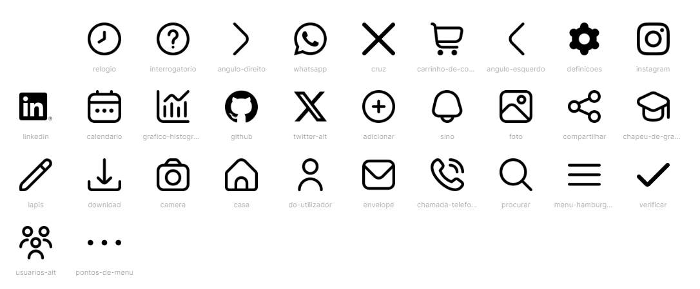

# Template padrão do site

O template foi projetado para ter uma navegação simples e intuitiva, garantindo um fácil entendimento no ambiente acadêmico.

## Design

Detalhe os layouts que serão utilizados. Apresente onde será colocado o logo do sistema. Defina os menus padrões, entre outras coisas.

## Cores

Foi definida uma paleta de cores de tons de verde e branco como cores principais, pois apresenta uma harmonia visual e psicológica que pode ser benéfica para o engajamento e a eficácia do aprendizado. Essa paleta de cores é crucial para criar a atmosfera certa para um site, especialmente em um ambiente acadêmico onde a concentração e a motivação dos alunos são essenciais.

Com base no profissionalismo, foi escolhida a cor Midnight Blue (#22577A), uma cor sóbria e profissional que pode ajudar a estabelecer um tom sério e acadêmico para o site. 

Para trazer calma e concentração aos alunos, foram escolhidas as cores Light Green (#38A3A5) e o verde mais claro (#57CC99), que são cores tranquilas e refrescantes que podem promover um ambiente calmo e concentrado. 

Seguindo a proposta do projeto que visa organizar o ambiente acadêmico dos alunos, foram escolhidas as cores White Smoke (#F2F2F2) e o verde claro (#C7F9CC), que são cores suaves e neutras que podem ser usadas para criar um design limpo e espaçoso, facilitando a leitura e a navegação.

## Tipografia

Apresente as fontes que serão utilizadas e sua função no site. As principais funções são: Título de página, Título de Seção, Rótulos de componentes e Corpo de Texto.

## Iconografia

Utilizamos estes ícones para o site.
(https://icons8.com.br/icons/collections/EPEbbXyV2w1l)

> **Links Úteis**:
>
> -  [Como criar um guia de estilo de design da Web](https://edrodrigues.com.br/blog/como-criar-um-guia-de-estilo-de-design-da-web/#)
> - [CSS Website Layout (W3Schools)](https://www.w3schools.com/css/css_website_layout.asp)
> - [Website Page Layouts](http://www.cellbiol.com/bioinformatics_web_development/chapter-3-your-first-web-page-learning-html-and-css/website-page-layouts/)
> - [Perfect Liquid Layout](https://matthewjamestaylor.com/perfect-liquid-layouts)
> - [How and Why Icons Improve Your Web Design](https://usabilla.com/blog/how-and-why-icons-improve-you-web-design/)
